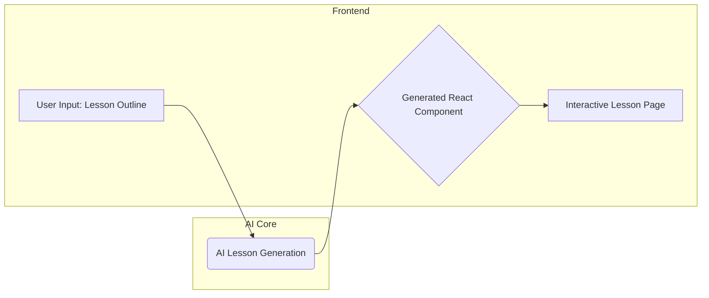
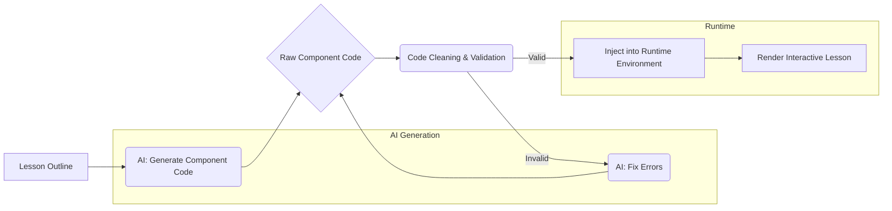
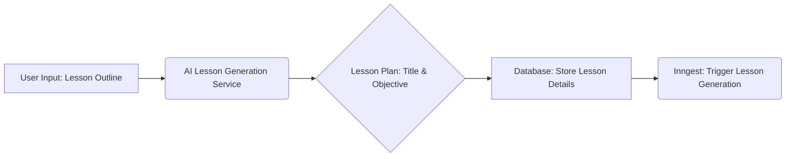
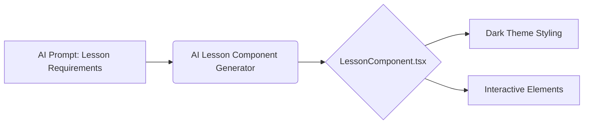
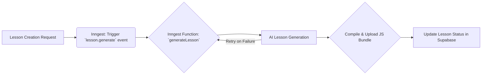

## Project Purpose: AI-Powered Interactive Course Generation

The `coursegen` project automates the creation of dynamic educational content. It leverages AI to transform simple lesson outlines into fully functional, interactive React components.

---

### Core Functionality

The system takes a user-provided lesson outline and uses AI to generate a complete, self-contained React component. This component is then made available for interactive learning.



**Key AI Prompts & Tools:**

*   `__lesson_writer_base_prompt`: Defines the core requirements for generating a React component, including naming conventions, modern React patterns, production-readiness, and strict dark theme styling.
*   `__lesson_writer_error_prompt`: Used for retrying generation when the initial component fails to compile or render, providing error details for correction.
*   `generate_lesson` tool: Orchestrates the AI process to formulate a topic into a structured lesson.
*   `generate_AiImage_tool`: Enables AI-generated images for educational content.

---

### Component Generation Flow

The process involves AI generating code, which is then cleaned, validated, and injected into a React environment for rendering.



**Code Transformation Example (`app/lesson/[id]/page.tsx`):**

The generated code is wrapped to inject necessary React hooks and available UI components (from `window.__REGISTRY__` and `window.__SHADCN__`).

```typescript
// Example of code wrapping for runtime execution
const wrappedCode = `
const React = window.__REACT__;
const { useState, useEffect, useCallback, useMemo, useRef } = React;

// Registry components
const { Box, Text, Card, ... } = window.__REGISTRY__;

// Shadcn UI components
const { Button, Input, Slider, ... } = window.__SHADCN__;

${codeWithoutImports} // The AI-generated LessonComponent code

export default LessonComponent
`;
```

---

## Key Features

This section highlights the core functionalities and technologies powering the course generation platform.

---

### AI-Powered Lesson Generation

Leverages AI to transform user-provided outlines into structured, interactive lessons.

*   **Process:** Takes a lesson outline and generates a detailed lesson plan, including title and learning objectives.
*   **Technology:** Utilizes AI models (e.g., Gemini Flash) for content generation.
*   **Integration:** Triggers background processing via Inngest for lesson creation.



---

### Interactive Component Creation

Generates self-contained React components for lessons, enabling rich user experiences.

*   **Output:** Produces production-ready, error-free React components.
*   **Styling:** Enforces a strict dark theme with specific text contrast rules.
*   **Interactivity:** Supports various interactive elements and visualizations.



### Inngest for Background Processing

Manages asynchronous tasks like lesson compilation and AI generation.

*   **Event-Driven:** Listens for `lesson.generate` events to initiate processing.
*   **Retries:** Implements automatic retries for failed lesson generation attempts.
*   **Error Handling:** Captures and reports errors during the generation process.


## Technical Stack

This section outlines the core technologies and libraries powering `coursegen`. We leverage a modern, robust stack for building dynamic and interactive educational content.

---

### Frontend Framework

**Next.js (App Router)** provides a powerful framework for building performant, server-rendered React applications. The App Router simplifies routing, data fetching, and layout management.

*   **React:** The declarative UI library at the heart of our frontend.
*   **TypeScript:** Ensures type safety and improves developer experience.
*   **Tailwind CSS:** A utility-first CSS framework for rapid, responsive styling.

### Backend & Data

**Supabase** serves as our backend-as-a-service, providing a PostgreSQL database, authentication, and storage.

*   **Database:** PostgreSQL for structured data.
*   **Authentication:** Secure user management.
*   **Storage:** For hosting assets like compiled code.

---

### Asynchronous Operations & AI

**Inngest** handles background tasks and asynchronous workflows, particularly for AI-driven content generation.

*   **Serverless Functions:** For scalable, event-driven processing.
*   **AI SDK:** Integrates with Large Language Models (LLMs) for content creation.

---

### AI Integration

The **AI SDK** is crucial for interacting with LLMs to generate lesson content, code, and potentially images.

*   **LLM Interactions:** Powering dynamic content generation.
*   **Tooling:** Defining functions for AI to use.

---

### UI Components

**Shadcn UI** provides a collection of reusable, unstyled UI components that are easily customizable.

*   **Component Library:** Buttons, inputs, cards, etc.
*   **Accessibility:** Built with accessibility in mind.

---


### Code Execution & Rendering

Dynamically compiled and executed JavaScript code is used to render interactive lesson components.

*   **Dynamic Imports:** Loading compiled code from a blob URL.
*   **VM2:** For safely executing untrusted code in Inngest functions.

---

### Architecture Overview

This diagram illustrates the high-level flow of how lessons are generated and served.

```mermaid
flowchart LR
    subgraph User Interface
        A[Course Creation UI] --> B(User Input: Outline)
    end
    subgraph Backend Services
        B --> C{Inngest Function: Generate Lesson}
        C --> D[AI SDK: LLM for Lesson Plan]
        D --> E[Supabase: Store Lesson Plan]
        E --> F{Inngest Function: Write Lesson Component}
        F --> G[AI SDK: LLM for Code Generation]
        G --> H[Supabase: Store Compiled Code]
        H --> I[API Route: Serve Lesson Code]
    end
    subgraph Client Application
        J[Lesson Page] --> I
        I --> K[Dynamic Code Execution]
        K --> L[Rendered Lesson Component]
    end
    
    classDef ui fill:#2D3748,stroke:#4A5568,stroke-width:2px,color:#E2E8F0
    classDef backend fill:#1A202C,stroke:#2D3748,stroke-width:2px,color:#E2E8F0
    classDef client fill:#1F2937,stroke:#374151,stroke-width:2px,color:#E2E8F0
    
    class A,B ui
    class C,D,E,F,G,H,I backend
    class J,K,L client
